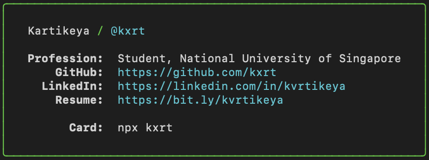

Check out my business card in your own terminal!



# Requirement
* `npm`

# Usage

```bash
npx kxrt 
```

# Credit

Forked from [@bitandbang](https://twitter.com/bitandbang/status/1075473070368919552)
([repo](https://github.com/bnb/bitandbang)) via [@natterstefan](https://github.com/natterstefan/)
